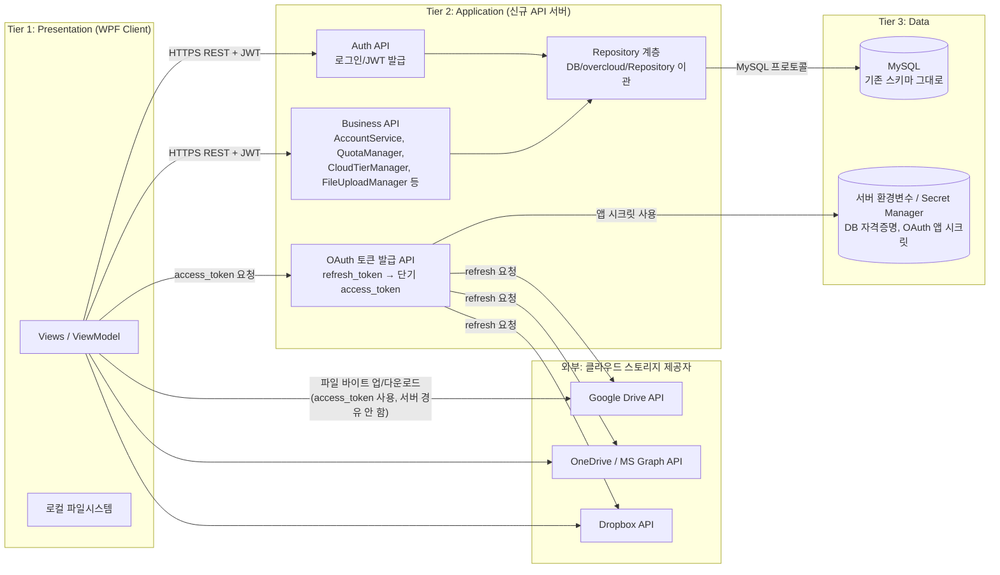

# OverCloud 3-Tier 아키텍처 전환 설계안

- 작성일: 2026-08-11
- 상태: 초안 (설계 확정 전)
- 목적: 재배포(신규 클라우드 이전)를 계기로 현재의 2-Tier(Fat Client) 구조를 3-Tier로 전환한다.

---

## 1. 배경 및 목표

캡스톤은 마감되었고 현재는 리팩토링 단계다. 기존에는 AWS EC2 + RDS(MySQL, 서울 리전) 조합으로 배포했으나 프리티어 무료 기간이 종료되어, AWS에 한정하지 않고 새로운 클라우드로 재배포할 예정이다. 재배포는 인프라를 처음부터 다시 구성하는 작업이므로, 이번이 아키텍처를 개선할 수 있는 가장 저렴한 시점이다.

전환 목표:

1. **DB 자격증명 노출 제거** — 클라이언트 바이너리에 MySQL root 비밀번호가 하드코딩되어 배포되는 문제 해결
2. **OAuth 앱 시크릿 노출 제거** — Google/OneDrive/Dropbox 앱 단위 client secret이 클라이언트 로컬 경로(`C:\key\*.json`)에 의존하는 문제 해결
3. **중앙화된 비즈니스 로직** — 정책(할당량, 티어 선택 등)을 서버에서 일관되게 강제
4. **재배포 유연성** — DB/시크릿 위치를 서버 설정(환경변수 등)으로 분리해 클라우드를 바꿔도 클라이언트 재배포 없이 대응 가능

---

## 2. 현재 아키텍처 진단 (AS-IS) — 2-Tier

폴더는 `DB/`, `OverCloud/Services/`, `UI/overcloud/`로 나뉘어 계층화된 것처럼 보이지만, 실제로는 `overcloud.csproj`가 `DB/overcloud/**/*.cs`와 `OverCloud/Services/**/*.cs`를 전부 `<Compile Include>`로 끌어와 **하나의 WPF 실행 파일**로 컴파일한다.

```
[ WPF 클라이언트 프로세스 (사용자 PC) ]
  ├─ Presentation (Views, XAML)
  ├─ Business Logic (OverCloud/Services — AccountService, QuotaManager, FileUploadManager ...)
  └─ Data Access (DB/overcloud/Repository — MySqlConnection 직접 생성)
         │
         │  MySQL 프로토콜, TCP 3306 직접 접속
         ▼
[ MySQL DB 서버 ]
```

### 확인된 문제

| 문제 | 근거 | 영향 |
|---|---|---|
| DB root 비밀번호 하드코딩 | `UI/overcloud/overcloud/DbConfig.cs:6` — `uid=root;pwd=Wodn134679!!;` | 배포된 모든 클라이언트 exe에 DB 전체 권한 계정이 노출됨 |
| MySQL 포트가 모든 사용자에게 열려있어야 함 | 클라이언트가 DB에 직접 접속 (`AccountRepository.cs` 등 전 Repository) | DB 서버를 인터넷에 노출, 공격 표면 확대 |
| OAuth 앱 시크릿이 로컬 절대경로 의존 | `GoogleAuthHelper.cs:17`, `OneDriveAuthHelper.cs:25`, `DropboxAuthHelper.cs:10` — `C:\key\*.json` | 개발자 PC 외 배포 환경에서는 해당 파일이 없어 OAuth 로그인 자체가 불가능할 가능성이 높음 |
| 비즈니스 로직이 클라이언트에만 존재 | `LoginController.cs` — AccountService/QuotaManager/CloudTierManager 등을 클라이언트가 직접 생성·실행 | 클라이언트를 변조하면 할당량/티어 정책을 우회 가능 |

---

## 3. 목표 아키텍처 (TO-BE) — 3-Tier



핵심 원칙: **DB 접속과 비밀 정보 관리는 서버로 옮기되, 대용량 파일 바이트 전송은 지금처럼 클라이언트 ↔ 클라우드 제공자 직접 경로를 유지한다.** (근거는 5.1 참고)

---

## 4. 계층별 책임 정의

### 4.1 Presentation Tier — WPF 클라이언트 (기존 UI 프로젝트)

- 유지: Views/XAML, 로컬 파일시스템 접근, 클라우드 제공자와의 실제 업/다운로드 바이트 전송
- 제거: `DbConfig.cs`의 connectionString, `MySqlConnection` 직접 생성 코드, `C:\key\*.json` 직접 로드 코드
- 추가: API 서버 호출용 `HttpClient` 래퍼, JWT/세션 토큰 보관, 로그인 시 API 서버로부터 access_token 발급받는 흐름

### 4.2 Application Tier — 신규 API 서버 (ASP.NET Core Web API 권장)

기존 `OverCloud/Services/*`, `DB/overcloud/Repository/*`를 그대로 이 프로젝트로 이관한다 (코드가 이미 UI와 분리돼 있어 이식 자체는 크지 않음). `LoginController.cs`가 이미 사실상의 조립부(composition root) 역할을 하고 있으므로, 이를 ASP.NET Core의 DI 컨테이너 등록 코드로 변환하는 것이 자연스러운 시작점이다.

- 인증/인가: 로그인 API, JWT 발급/검증
- 비즈니스 로직: `AccountService`, `QuotaManager`, `CloudTierManager`, `FileUploadManager`/`DownloadManager`/`DeleteManager`/`CopyManager`, `CooperationManager` 등 — 정책 판단은 전부 서버에서 수행
- OAuth 토큰 중개: 사용자별 `refresh_token`은 DB에 보관(기존과 동일), 서버가 앱 시크릿으로 `access_token`을 교환해 클라이언트에는 **만료시간이 짧은 access_token만** 내려줌 (앱 시크릿 자체는 클라이언트에 절대 전달하지 않음)
- DB 자격증명 보관: connectionString을 서버 환경변수/Secret Manager로 관리

### 4.3 Data Tier — MySQL

- 스키마 변경 없음. 접속 주체만 "클라이언트 전체"에서 "API 서버 하나"로 축소됨 → DB 서버를 사설 네트워크로 격리하고 API 서버에서만 접근 허용 가능해짐 (보안 개선)
- 기존 DB 백업/데이터는 그대로 신규 인프라의 MySQL로 마이그레이션(mysqldump 등)하면 됨

---

## 5. 핵심 설계 결정사항

### 5.1 파일 전송 경로: 서버 프록시 vs 클라이언트 직접 전송

**결정: 클라이언트 직접 전송 유지 (서버 프록시 안 함)**

- 현재 `FileUploadManager.cs`는 클라이언트가 `service.UploadFileAsync(...)`로 Google/OneDrive/Dropbox에 직접 바이트를 전송한다.
- 만약 API 서버가 파일 바이트까지 중계하면, 같은 데이터가 "클라이언트→API 서버→클라우드 제공자"로 두 번 왕복하게 되어 서버 대역폭 비용과 지연이 두 배로 늘어난다. 무료/저비용 클라우드로 재배포하는 상황에서는 이 비용이 특히 부담된다.
- 따라서 서버는 **메타데이터(어느 계정에 얼마나 저장할지, 할당량 등)와 access_token 발급**만 담당하고, 실제 바이트는 지금처럼 클라이언트가 클라우드 제공자와 직접 주고받는다.

### 5.2 인증/인가 흐름

1. 클라이언트가 API 서버에 아이디/비밀번호로 로그인 요청
2. 서버가 자격증명 검증 후 JWT(또는 세션 토큰) 발급
3. 이후 모든 API 호출에 JWT를 첨부
4. 클라우드 스토리지 작업이 필요할 때, 클라이언트가 API 서버에 "이 계정의 access_token 줘" 요청 → 서버가 DB의 refresh_token + 서버 보관 앱 시크릿으로 access_token 교환 → 클라이언트에 access_token만 반환
5. 클라이언트는 이 access_token으로 클라우드 제공자 API를 직접 호출

### 5.3 OAuth 앱 시크릿 이관 계획

| 현재 | 이관 후 |
|---|---|
| `GoogleAuthHelper.cs` → `C:\key\credential.json` | 서버 환경변수 또는 Secret Manager |
| `OneDriveAuthHelper.cs` → `C:\key\onedrive_credential.json` | 서버 환경변수 또는 Secret Manager |
| `DropboxAuthHelper.cs` → `C:\key\dropbox.json` | 서버 환경변수 또는 Secret Manager |

최초 OAuth 인가(사용자 동의 화면 띄우기)는 브라우저 리다이렉트가 필요해 클라이언트가 트리거하지만, **콜백에서 받은 authorization code를 access/refresh token으로 교환하는 단계는 서버가 대행**한다 (client secret이 필요한 단계이므로).

### 5.4 DB 자격증명 이관 계획

`DbConfig.cs`의 connectionString(현재 root 계정)을 제거하고:
- API 서버 전용 DB 계정을 새로 발급 (root 아님, 필요한 테이블에 대한 권한만)
- connectionString은 서버 환경변수(`.env` 또는 클라우드 provider의 secret 저장소)로 관리

### 5.5 JWT 정책 (access/refresh 분리)

JWT는 무상태(stateless)라 발급 후에는 서버가 개입해 즉시 무효화하기 어렵다. 계정 정지·할당량 정책 변경이 즉시 반영돼야 하므로 다음 원칙으로 간다:

- **access token**: 신원 증명 용도로만 사용, TTL 15~30분. 짧게 잡아 탈취/오남용 시 피해 시간을 제한한다.
- **authorization(정지 여부, 할당량 등)은 토큰 내용이 아니라 매 요청마다 DB 최신 상태로 판단**한다 — 즉 토큰이 유효해도 서버가 "이 계정 지금 정지 상태인가?"는 항상 다시 확인. 이렇게 하면 별도의 revocation list 없이도 정지가 즉시 반영된다.
- **refresh token**: DB에 저장(사용자당 1개, 로그인 시 갱신). 계정 정지/비밀번호 변경 시 DB의 refresh token을 무효화하면 재로그인이 막히고, 이미 발급된 access token은 TTL 만료 후 자연 소멸한다.

### 5.6 LAN 전송 signaling — DB 직접 조회 문제

`LanTransferService.SendFileAsync`가 상대방 IP를 얻기 위해 `_accountRepository.GetLocalIp(targetUserId)`를 **클라이언트에서 직접** 호출하고 있고 (`OverCloud/Services/LanTransferService.cs:145`), 이는 `Account` 테이블을 `SELECT local_ip FROM Account WHERE ID=@id AND is_online=1`로 직접 쿼리하는 것이다(`DB/overcloud/Repository/AccountRepository.cs:178`). 로그인/로그아웃 시 `local_ip`/`is_online`을 갱신하는 것도 클라이언트가 직접 UPDATE한다(`AccountRepository.cs:163`).

3-Tier 전환 후 클라이언트가 DB에 못 붙으면 이 조회·갱신이 그대로 실패해 **LAN 전송 기능 자체가 깨진다.** P2P 파일 전송(바이트 전송)은 여전히 클라이언트 간 직접 TCP로 남겨두되, signaling(피어 IP 조회, 온라인 상태 갱신)만 API로 옮긴다:

- `POST /api/presence` — 로그인/로그아웃 시 `local_ip`, `is_online` 갱신
- `GET /api/presence/{targetUserId}` — 상대방이 온라인이면 IP 반환, 아니면 null

이 두 엔드포인트가 없으면 LAN 전송은 3-Tier 전환과 동시에 회귀(regression)한다.

### 5.7 동시성 (Phase 2 선행 조건)

3-Tier 전환으로 여러 사용자 요청이 API 서버 한 프로세스에서 진짜 동시(멀티스레드)로 처리되기 시작하면서 2-Tier(클라이언트 프로세스당 사용자 1명)에서는 드러나지 않던 위험들. QuotaManager 등을 API 엔드포인트에 연결하는 Phase 2 전에 처리해야 한다.

- [ ] **`StorageSessionManager` 전역 static 캐시 제거, 매 요청 DB 재계산으로 전환** — `OverCloud/Services/StorageManager/StorageSessionManager.cs:26`의 `static List<CloudQuotaInfo> Quotas`는 프로세스 전역이며 사용자별 파티션이 없다. 이미 `Api/OverCloud.Api.csproj:27`의 `Compile Include`로 API 프로젝트에 컴파일되어 들어가 있어서, QuotaManager를 엔드포인트에 연결하는 순간 `GetTotalAvailableCapacityKB()`(79행)처럼 리스트 전체를 합산하는 메서드가 서로 다른 사용자의 용량 정보를 섞어버린다. DI lifetime(Scoped/Singleton)으로는 해결 불가 — `static class`라 무조건 프로세스 전역이다. QuotaManager를 API에 연결하기 전 필수 선행 작업.
- [ ] **`AccountFile_Redistribution` 대상 storage row에 `SELECT ... FOR UPDATE`** — `QuotaManager.cs:159` 재분배 로직은 후보 storage를 조회(`GetCandidateStorages`)한 뒤 업로드가 끝날 때까지 아무 락도 걸지 않아, 재분배 두 건(또는 재분배+일반 업로드)이 같은 target storage를 동시에 후보로 골라 쿼터를 초과시킬 수 있다. 대상 `CloudStorageInfo` row를 트랜잭션 안에서 `SELECT ... FOR UPDATE`로 잠그면 **그 storage의 쿼터 초과만** 방지한다 — 완전한 레이스 해결은 아니며, 파일 단위 부분 실패(일부 파일만 이동)나 청크 업로드 중단 시 롤백 미구현(`// TODO: uploadedChunks 순회하며 삭제 구현 가능`) 같은 나머지 문제는 그대로 남는 것으로 알려진 한계로 명시한다.
- [ ] **Repository 계층 동기/비동기 확인, 가능하면 async로 전환** — 확인 결과 `AccountRepository`/`FileRepository`/`StorageRepository` 전부 async 메서드가 0개이며, 모든 메서드가 `MySqlConnection.Open()` / `ExecuteReader()` / `ExecuteNonQuery()` / `ExecuteScalar()` 동기 호출로 구현돼 있다. ASP.NET Core에서 동기 DB 호출은 요청당 스레드풀 스레드 하나를 DB 왕복이 끝날 때까지 통째로 점유한다 — 동시 요청이 늘어나면(여러 팀원이 동시에 업로드/다운로드) 스레드풀 고갈로 이어져 관련 없는 다른 요청까지 타임아웃될 수 있다(8절 위험과 연결). `OpenAsync`/`ExecuteReaderAsync`/`ExecuteNonQueryAsync`/`ExecuteScalarAsync`로 전환이 필요하지만, Repository 3개 클래스 + 인터페이스 + 이를 호출하는 모든 Service 메서드까지 연쇄적으로 바뀌는 큰 기계적 변경이라 전체를 한 번에 진행하기보단 메서드 하나로 패턴을 먼저 잡아 검토받은 뒤 확산하는 걸 권장.

---

## 6. API 서버 엔드포인트 초안

| 영역 | 메서드/경로 (예시) | 대응하는 기존 코드 |
|---|---|---|
| 인증 | `POST /api/auth/login` | `LoginController`, `AccountRepository` |
| 계정 | `GET/POST /api/accounts` | `AccountService`, `AccountRepository` |
| 스토리지 연결 | `POST /api/storages/{provider}/authorize-callback` | `GoogleAuthHelper`, `OneDriveAuthHelper`, `DropboxAuthHelper` |
| 토큰 발급 | `GET /api/storages/{id}/access-token` | `GoogleTokenProvider`, `OneDriveTokenRefresher`, `DropboxTokenRefresher` |
| 파일 메타데이터 | `GET/POST/DELETE /api/files` | `FileRepository`, `FileUploadManager` 등 (메타데이터만) |
| 할당량 | `GET /api/quota` | `QuotaManager` |
| 협업 | `GET/POST /api/coop/*` | `CooperationManager`, `CoopUserRepository` |
| 이슈 | `GET/POST /api/issues/*` | `FileIssueRepository`, `FileIssueCommentRepository` |
| LAN signaling | `POST /api/presence`, `GET /api/presence/{targetUserId}` | `LanTransferService.SendFileAsync`, `AccountRepository.GetLocalIp` (5.6 참고) |

> LAN 전송의 **P2P 바이트 전송 자체**(`LanTransferService`의 TCP 송수신, `RelayOverCloud`)는 이번 3-Tier 전환 범위와 무관하게 클라이언트에 그대로 둔다. 다만 피어 IP/온라인 상태 조회는 DB 접근이므로 위 `presence` 엔드포인트로 옮겨야 한다 (5.6 참고).

---

## 7. 마이그레이션 단계

- [ ] **Phase 1 — API 서버 뼈대**: ASP.NET Core Web API 프로젝트 생성, `DB/overcloud/Repository`·`OverCloud/Services` 이관, `LoginController`를 DI 등록으로 전환
- [ ] **Phase 2 — 인증 계층**: 로그인 API + JWT 발급/검증 미들웨어 추가
- [ ] **Phase 3 — OAuth 시크릿 이관**: 3개 Auth Helper를 서버 API로 이동, access-token 발급 엔드포인트 구현
- [ ] **Phase 4 — 클라이언트 리팩토링**: `DbConfig.cs`/직접 DB 접속 코드 제거, `LanTransferService`의 DB 직접 조회를 `presence` API 호출로 교체, API 클라이언트로 교체, 로그인/토큰 발급 흐름 변경
  - ⚠️ 이 Phase부터는 신규 API 서버 없이는 클라이언트가 아예 동작하지 않는다 (빅뱅 전환). 아래 롤백 계획을 먼저 준비한 뒤 배포할 것.
- [ ] **Phase 5 — 인프라 결정 및 배포**: 신규 클라우드 선정(무료/저비용 MySQL 호스팅 포함), API 서버 배포, DB 데이터 마이그레이션
  - **롤백 계획**: 구버전 클라이언트 설치파일을 별도 보관, 신규 스택을 일정 기간 스모크 테스트한 뒤에만 배포 링크(`Server/public/download.html`)를 전환, 구 DB(RDS) 스냅샷은 신규 스택 안정화 확인 후 최소 N일(예: 2주) 보존 후 폐기
- [ ] **Phase 6 — 보안 마감**: DB 계정을 root→최소권한 계정으로 교체, HTTPS 적용, 기존 노출됐던 비밀번호/시크릿 전부 로테이션(재발급), 로그인/토큰 발급 엔드포인트에 rate limiting 적용, 전 엔드포인트에 입력 검증 및 IDOR(내 리소스만 접근 가능한지) 점검

---

## 8. 리스크 및 미해결 이슈

- 기존에 노출됐던 root 비밀번호와 OAuth 앱 시크릿은 재배포 시 **반드시 재발급/로테이션**해야 한다 (git 이력에 남아있을 수 있으므로 유출된 것으로 간주).
- API 서버 자체의 가용성이 곧 서비스 가용성이 됨 — 기존에는 DB만 죽으면 됐지만 이제 API 서버도 단일 장애점이 됨.
- 오프라인/네트워크 불안정 시나리오에 대한 클라이언트 동작(캐시, 재시도)을 새로 고려해야 함.
- **LAN 전송 signaling 회귀**: `LanTransferService`가 피어 IP/온라인 상태를 DB에서 직접 조회·갱신하고 있어(5.6 참고), `presence` API를 Phase 4와 동시에 만들지 않으면 클라이언트 DB 직접 접속을 끊는 순간 LAN 전송이 깨진다.
- **JWT는 즉시 무효화가 안 됨**: 정지/정책 변경을 즉시 반영하려면 authorization 판단을 토큰이 아니라 매 요청 시 DB 조회로 해야 한다 (5.5 참고). 이를 놓치면 "정지시켰는데 access token 만료 전까지 계속 쓸 수 있는" 창구가 생긴다.
- **공격 표면이 없어진 게 아니라 이동함**: 지금은 MySQL 3306 포트만 막으면 됐지만, 전환 후엔 API 서버가 공개적으로 열려있어야 하므로 인증 우회·요청 위조·무차별 대입에 대한 방어(rate limiting, 입력 검증, IDOR 점검)가 새로 필요하다 (Phase 6에 반영).
- **Phase 4는 빅뱅 배포**: 클라이언트가 DB 직접 접속 코드를 걷어내는 순간부터 신규 API 서버 없이는 클라이언트가 동작하지 않는다. 롤백 계획(구버전 exe 보관, 구 DB 스냅샷 보존 기간) 없이 이 Phase를 배포하지 말 것 (Phase 5 참고).

## 9. 다음 결정 필요 사항

- 무료/저비용으로 MySQL 호스팅이 가능한 클라우드 조사 및 선정 (별도 조사 예정)
- API 서버 호스팅 방식(같은 VM에 함께 둘지, 별도 컨테이너/PaaS로 분리할지)
